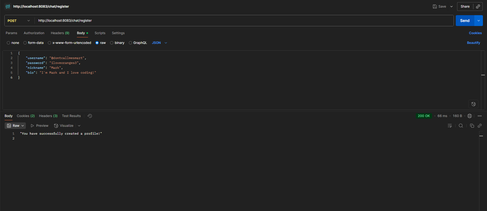
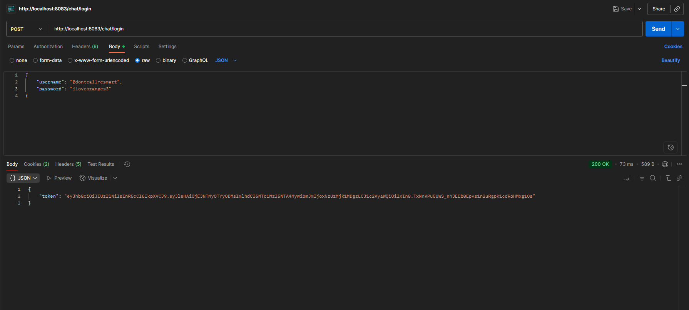
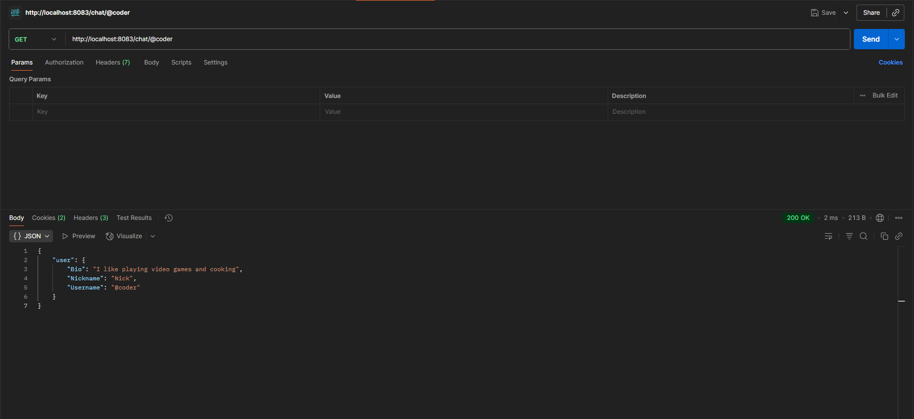
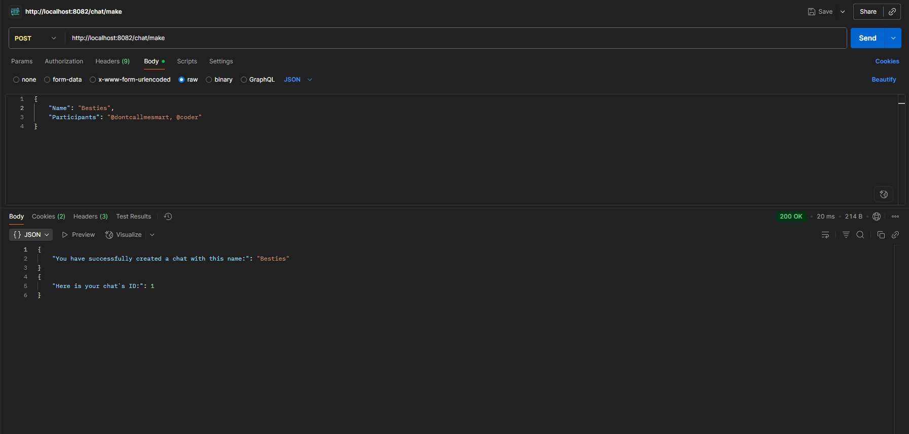
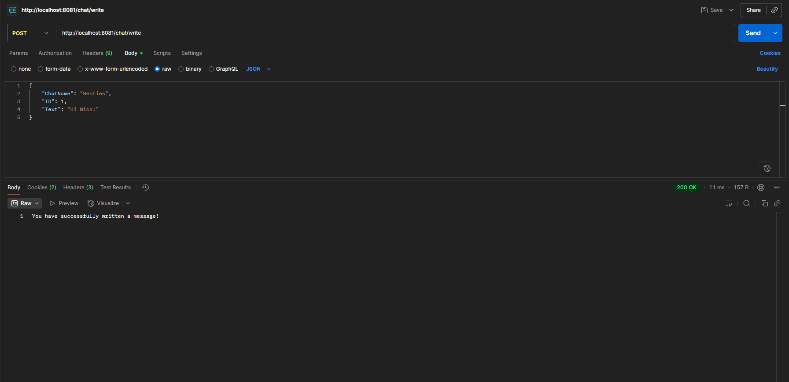
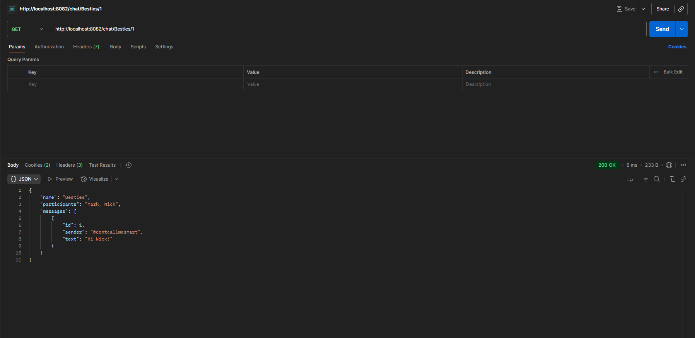

# Chat
This is a pet-project Chat API, that features creating profiles, making chats with other users or yourself, sending messages to them and checking other users' profiles. And of course you can check your chats to find some new messages, that were written by other users.

## Table of contents
* [Introduction](#introduction)
* [Installation](#installation)
* [Quick start](#quick-start)
* [Usage](#usage)
* [Known issues and limitations](#known-issues-and-limitations)

## Introduction
The main goal of this project was to practice coding microservices. I believe, that I succeeded in this. The project isn't meant to solve real problems, but it might be useful in some ways.

## Installation

### Prerequisites
* [Go](https://go.dev/doc/install) v1.24.2
* [Postman](https://www.postman.com/downloads/) (optionally)

### Installing the project
To install the project, simply use this command:

* Clone the repository:
```bash
git clone https://github.com/MKode312/Chat_go.git
```

## Quick start

### Running
To start the system, use the following commands:

* Change directory:
```bash
cd Chat_go
```

* Install all missing dependencies if there are some:
```bash
go mod tidy
```

* Run the userServer microservice:
```bash
go run cmd/userServer/main.go
```

* Run the chatmakerServer microservice:
```bash
go run cmd/chatmakerServer/main.go
```

* Run the msgServer microservice:
```bash
go run cmd/msgServer/main.go
```

### Using the system
1. To create a profile, you need to send a POST request to this URL: [http://localhost:8083/chat/register](http://localhost:8083/chat/register)

Example request:
<p align="center">
<br>
</p>

2. To login, send a POST request to this URL: [http://localhost:8083/chat/login](http://localhost:8083/chat/login)

Example request:
<p align="center">
<br>
</p>

3. To check user profile, send a POST request to this URL: http://localhost:8083/chat/{username} (You need to put a username, which starts with @)

Example request:
<p align="center">
<br>
</p>

4. To make a chat, send a POST request to this URL: [http://localhost:8082/chat/make](http://localhost:8082/chat/make)

Example request:
<p align="center">
<br>
</p>

5. To write a message to the chat, send a POST request to this URL: [http://localhost:8081/chat/write](http://localhost:8081/chat/write)

Example request:
<p align="center">
<br>
</p>

6. To check a chat, send a POST request to this URL: http://localhost:8082/chat/{Name of the chat}/{ID of the chat}

Example request:
<p align="center">
<br>
</p>

## Usage
Now, more about the API and it's functionality. All the usernames must be unique, but nicknames and bio may be repeated. Names of thet chats may be repeated too, but ID of the chats is unique.

When you login, you are given the JWT authorization token. It is automatically saved in the cookie called "auth_token", since there is a middleware, that checks your token every single time you try to use some functions of the app. The JWT token expires after 10 minutes, so you will need to login again to get a new one.

Also, you can make a chat with yourself to save some important information.


## Known issues and limitations
There are several errors you can encounter. For instance, you obviously cannot login into account, which isn't created. Or if you try to check a profile, which doesn't exist, you get the error. Check the username you have put to the link.

As for the chats, you can't check the chat if you aren't a participant of it. And you can't create a chat if some usernames don't exist.

If you encounter some unknown issues, please write about them in "Issues" in my GitHub repository.
